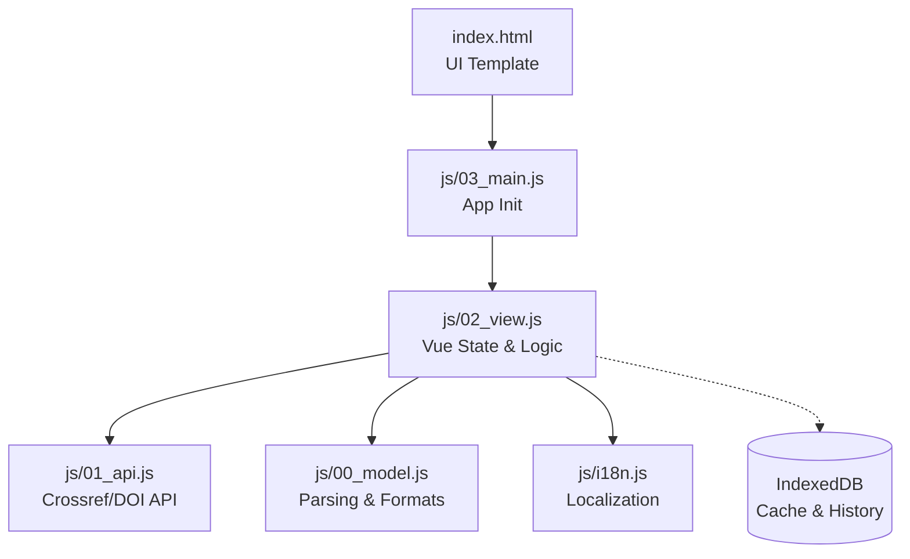

# DOIGenMe Specification

## §G Goal
Extract metadata from DOI strings, format as Vancouver citations, and manage bulk PDF downloads in a lightweight, build-less web app.

## §A Architecture

**Evaluation**: 
- **Pros**: Modular separation of concerns (Model, API, View, Main). Zero build tools required -> instant edit & deploy. CDN-based dependencies keep the repo tiny. IndexedDB enables high-capacity local storage.
- **Cons**: No static typing (TypeScript) or bundle optimization (minification/tree-shaking).
- **Verdict**: Excellent and highly extensible for a specialized web tool. The current structure is very robust and easy to maintain. No immediate structural changes needed.

## §C Constraints
- Pure Vanilla JS, Vue via CDN, Tailwind via CDN.
- No Node.js build step (no Vite, Webpack).
- Rate limit Crossref API (max 5 concurrent, 300ms delay).
- CORS restrictions on bulk PDF downloading handled gracefully via fallback UI.

## §I Interfaces
- `01_api.js`: `fetchCrossrefData(doi)`, `fetchPdfUrl(doi)`.
- `00_model.js`: `extractDOI(text)`, `formatVancouver(item)`.
- UI Modals: Settings, Failed PDF Links, Confirmation dialogs.

## §V Invariants
- V1. DOI parsing must identify valid 10.xxxx/xxxx patterns from raw text.
- V2. Unsuccessful API calls must not block the queue, but mark the item as failed.
- V3. All hardcoded text must use `t.*` from `i18n.js`.

## §T Tasks
| id | stat | description | cites |
|---|---|---|---|
| T1 | x | Core DOI extraction and API integration | V1, I.api |
| T2 | x | UI implementation with Vue & Tailwind CDN | C.vanilla |
| T3 | x | IndexedDB Cache and Projects history | V2 |
| T4 | x | Bulk PDF Queue with pause/resume | C.rate |
| T5 | x | Export (Copy, CSV) and Custom Modals | V3 |

## §B Bugs
| id | date | cause | fix |
|---|---|---|---|
| B1 | 2026-05-25 | Native alerts bad UX | Replaced with custom modal components |
| B2 | 2026-05-25 | CORS blocks PDF fetch | Catch block show modal with links |
